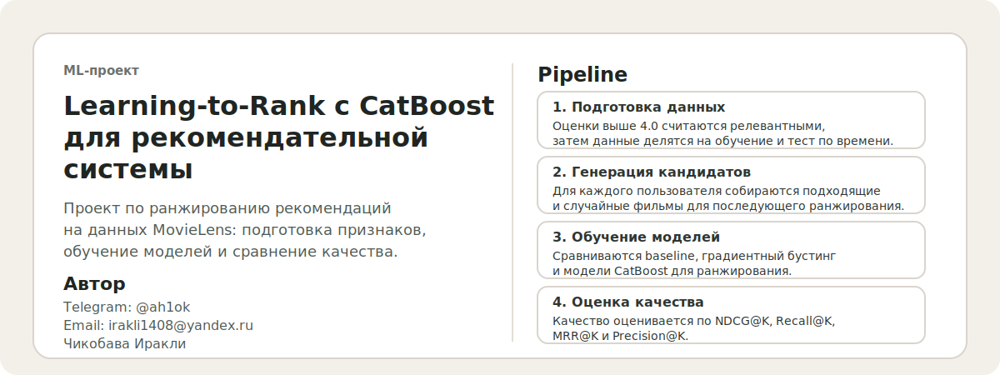
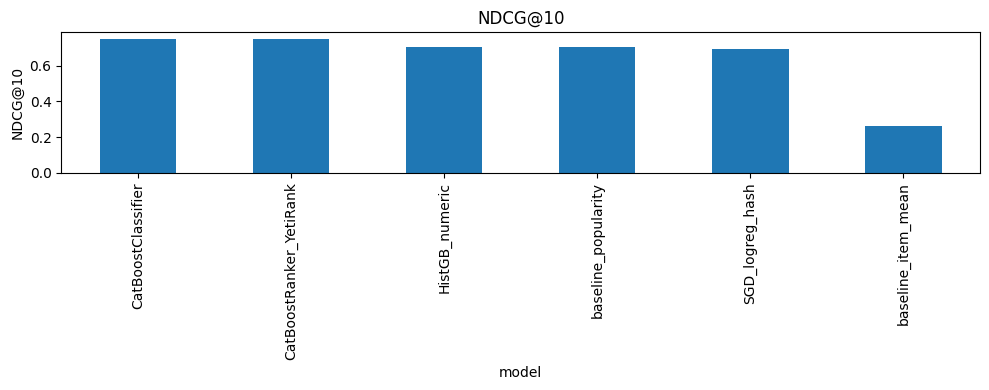
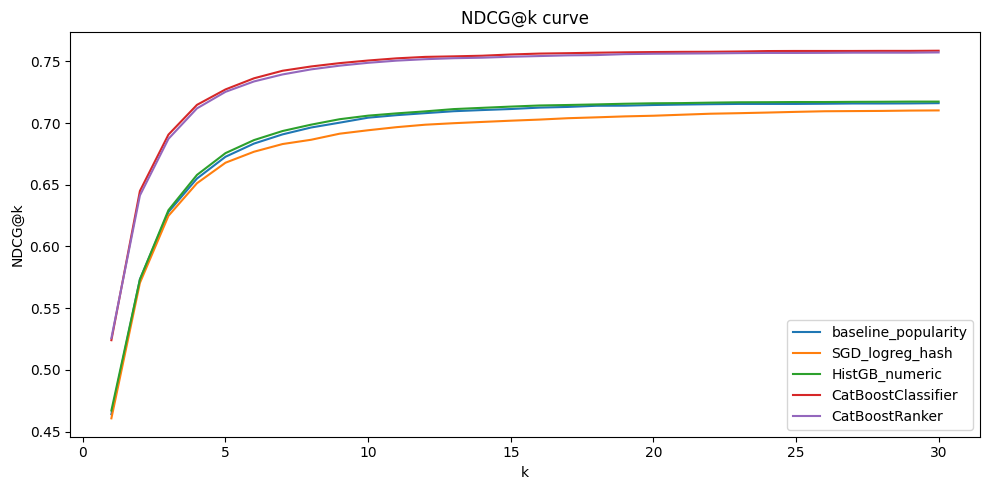

# RecSys Learning-to-Rank with CatBoost

<p align="center">
  
</p>

<p align="center">
  ML-проект по оффлайн-оценке рекомендательных моделей: от implicit feedback и генерации кандидатов до сравнения pointwise и learning-to-rank подходов.
</p>

## О проекте

В этом проекте реализован полный оффлайн-пайплайн ранжирования для рекомендательной системы на данных `MovieLens`. Логи пользовательских взаимодействий преобразуются в implicit feedback, затем строятся кандидаты для ранжирования, считаются признаки и сравниваются несколько моделей: от простых baseline-подходов до `CatBoostClassifier` и `CatBoostRanker` с `YetiRank`.

Проект хорошо подходит для портфолио, потому что показывает не только обучение модели, но и всю прикладную логику recsys-задачи: временное разбиение, negative sampling, candidate generation, ranking-метрики и сравнение нескольких семейств моделей в едином пайплайне.

## Кратко о проекте

| Параметр | Значение |
| --- | --- |
| Задача | Learning-to-Rank для рекомендательной системы |
| Датасет | `MovieLens 20M` |
| Сигнал | implicit feedback, позитив: `rating >= 4.0` |
| Число пользователей | `12,000` |
| Train positives | `867,489` |
| Test positives | `12,000` |
| Eval candidate rows | `1,705,614` |
| Число товаров | `18,065` |
| Лучшая модель по `NDCG@10` | `CatBoostClassifier` |
| Лучший `NDCG@10` | `0.750655` |
| `Recall@10` лучшей модели | `0.966333` |
| `MRR@10` лучшей модели | `0.680694` |

## Что реализовано

1. Преобразование `MovieLens ratings` в implicit feedback.
2. Временное разбиение по пользователю: последний позитив уходит в тест.
3. Генерация кандидатов для ранжирования: `1` позитив + отрицательные примеры через negative sampling.
4. Построение пользовательских, товарных и временных признаков.
5. Сравнение нескольких подходов к ранжированию в одной оффлайн-схеме.
6. Оценка моделей по `NDCG@K`, `Recall@K`, `MRR@K`, `Precision@K`.

## Какие модели сравниваются

- `baseline_popularity`
- `baseline_item_mean`
- `SGDClassifier` с hashed user/item признаками
- `HistGradientBoostingClassifier`
- `CatBoostClassifier`
- `CatBoostRanker` с `YetiRank`

## Результаты

По `NDCG@10` лучшей моделью стала `CatBoostClassifier`, немного обогнав `CatBoostRanker_YetiRank`. Это хороший практический результат: pointwise `CatBoost` оказался сильнее baseline-моделей и классических ML-подходов на подготовленных признаках.

| Модель | NDCG@10 | Recall@10 | MRR@10 | Precision@10 |
| --- | ---: | ---: | ---: | ---: |
| `CatBoostClassifier` | `0.750655` | `0.966333` | `0.680694` | `0.096633` |
| `CatBoostRanker_YetiRank` | `0.748794` | `0.964333` | `0.679065` | `0.096433` |
| `HistGB_numeric` | `0.705967` | `0.952333` | `0.627086` | `0.095233` |
| `baseline_popularity` | `0.704324` | `0.952000` | `0.625127` | `0.095200` |

## Визуализация

<p align="center">
  
  
</p>

По графикам видно, что `CatBoostClassifier` и `CatBoostRanker` стабильно идут выше остальных моделей, а baseline по популярности остается сильным ориентиром, но все же уступает моделям ранжирования.

## Признаки

- `user_cnt`, `user_mean_rating`
- `item_cnt`, `item_mean_rating`, `item_pos_cnt`
- временные признаки: `hour`, `dow`, `month`
- жанры из `movie.csv`, если файл доступен в `data/`
- hashed user/item признаки для линейной модели

## Как запустить

```bash
python -m venv .venv
.venv\Scripts\activate
pip install -r requirements.txt
jupyter notebook
```

Дальше:

1. Положи `rating.csv` и при необходимости `movie.csv` в папку `data/`.
2. Открой `notebooks/recsys.ipynb`.
3. Запусти ячейки сверху вниз.

Основные лимиты по числу пользователей, негативов и размеру train/eval задаются в первой конфигурационной ячейке ноутбука.

## Структура репозитория

```text
.
|-- assets/
|   |-- ndcg10_by_model.png
|   |-- ndcg_curve.png
|   `-- project-banner.svg
|-- notebooks/
|   `-- recsys.ipynb
|-- requirements.txt
`-- .gitignore
```

## Примечания

- Сгенерированные артефакты обучения `CatBoost` исключены из репозитория.
- В ноутбуке уже заложены ограничения по размеру выборки, чтобы проект стабильно запускался на обычном ноутбуке.
- При желании проект можно развить в сторону `two-stage recommender`, `ANN retrieval`, более сложного negative sampling и онлайн/AB evaluation.
